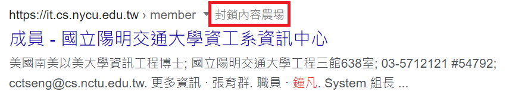

# 內容農場終結者

[English](README_en.md) 👈

這個酷東西可以幫你把 Google 搜尋頁面上的內容農場搜尋結果移除。

## 安裝

可以到 [Chrome 線上應用程式商店](https://chrome.google.com/webstore/detail/the-content-farm-terminat/chhekpgdckchblnfdelceaigmlfbakgn)安裝。

## 使用說明

安裝這個擴充套件之後，你在 Google 搜尋頁面上的每一條搜尋結果會被加上一個「終結內容農場」的灰色按鈕，如下圖所示。

按下那個按鈕之後，這個網域就會消失並進入黑名單。往後這個網域不會再出現在搜尋頁面上。

## Bugs

由於 Google 三不五時會調整搜尋頁面的 CSS ，導致這個擴充套件會不定時地失效。請寄一封 [email](mailto:me@hyperbola.me) 或發 issue 提醒維護者，感恩🙏🙏
