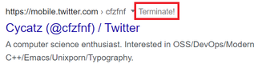

# The Content Farm Terminator

   

[中文](README.md) 👈

## Installation

Please install the plugin on [Chrome Store](https://chrome.google.com/webstore/detail/the-content-farm-terminat/chhekpgdckchblnfdelceaigmlfbakgn).

## Instruction

Once the plugin is installed, each result on Google search pages is appended with a grey button saying "Terminate!" as shown in the following picture.

Click the button and that domain will be permanently blocked and not shown on search pages.

## Bugs

The plugin may fail since the CSS changes from time to time. While I could not always keep an eye on the layout, it would be appreciated if you could send me an [email](mailto:me@hyperbola.me) or open an issue.
